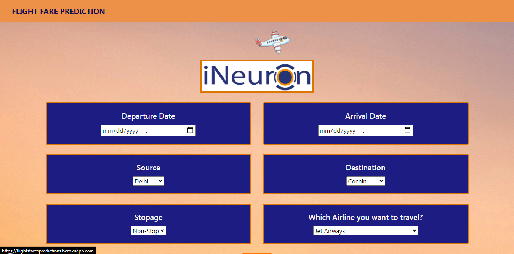

# Flights-Fare-Predictions

The main goal of this project is to predict the fares of the flights based on different factors available in the provided dataset.

## Table of Content
  * [Demo](#demo)
  * [Problem Statement](#problem-statement)
  * [Approach](#approach)
  * [Technologies Used](#technologies-used)
  * [Installation](#installation)
  * [Deployement on Heroku](#deployement-on-heroku)
  * [Detailed Project Reports](#detailed-project-reports)
  * [Bugs & Logs](#bugs--logs)
  * [Contributors](#contributors)

## Demo
Link: [https://flightsfarespredictions.herokuapp.com/](https://flightsfarespredictions.herokuapp.com/)




## Problem Statement
Travelling through flights has become an integral part of today’s lifestyle as more and more people are opting for faster travelling options. The flight ticket prices increase or decrease every now and then depending on various factors like timing of the flights, destination, and duration of flights various occasions such as vacations or festive season. Therefore, having some basic idea of the flight fares before planning the trip will surely help many people save money and time.

Inspiration
Can you build a machine learning model to accurately predict whether or not the patients in the dataset have diabetes or not?

## Approach
Data Exploration : I started exploring dataset using pandas,numpy,matplotlib and seaborn.

Data visualization : Ploted graphs to get insights about dependend and independed variables.

Feature Engineering : Removed missing values and created new features as per insights.

Model Building & Testing : Tried many machine learning algorithms and checked the base accuracy to find the best fit.

Pickle File : Selected model as per best accuracy and created pickle file.

User Interface & deployment :  Created an UI with a form that takes all the necessary inputs from user and shows the output.
                          After that I have deployed project on heroku.
## Technologies Used
 
   1. Python 
   2. Sklearn
   3. Flask
   4. HTMl, CSS
   5. XGBoost
   6. Pandas, Numpy 
   7. Heroku

## Dataset
[Download here](https://www.kaggle.com/nikhilmittal/flight-fare-prediction-mh)

## Installation
Click here to install [python](https://www.python.org/downloads/). To install the required packages and libraries, run this pip command in the project directory after cloning the repository:
```bash
git clone https://github.com/hrishikeshkini/Flights-Fare-Predictions.git
pip install -r requirements.txt
```
If pip is not already installed, Follow this [link](https://pip.pypa.io/en/stable/installation/)

## Deployement on Heroku
Create a virtual app on Heroku website. You can either connect your github profile or download cli to manually deploy this project.
Follow the instruction given on [Heroku Documentation](https://devcenter.heroku.com/articles/getting-started-with-python) to deploy a web app.

## Bugs & Logs

1. If you find a bug, kindly open an issue and it will be addressed as early as possible. [Open](https://github.com/hrishikeshkini/Flights-Fare-Predictions/issues)
2. Under localhost, logging is performed for all the actions and its stored onto logs.txt file
3. When the app is deployed on heroku, logs can be viewed on  heroku dashboard or CLI.

## Contributors
  [Hrishikesh Kini](https://github.com/hrishikeshkini)

